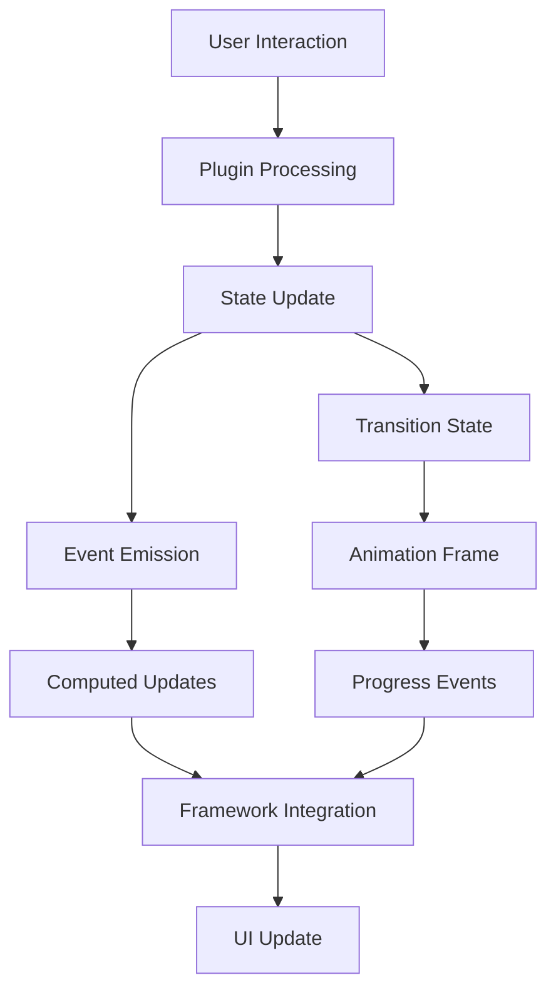
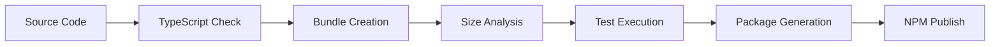

# Universal UI Protocol - System Architecture

> **Version**: 0.x (Pre-Release)  
> **Last Updated**: 2025

## System Overview

The Universal UI Protocol implements a **three-layer architecture** that separates concerns while maintaining universal compatibility:

```
┌─────────────────────────────────────────────────────┐
│                Presentation Layer                   │  ← Framework/CSS
│              (User Controlled)                      │     Your styling
└─────────────────────┬───────────────────────────────┘
                      │
┌─────────────────────▼───────────────────────────────┐
│                Protocol Layer                       │  ← UIP Core
│           (Framework Agnostic)                      │     State & Logic  
└─────────────────────┬───────────────────────────────┘
                      │
┌─────────────────────▼───────────────────────────────┐
│                Enhancement Layer                    │  ← Plugins
│              (Optional & Composable)                │     Behavior
└─────────────────────────────────────────────────────┘
```

This separation enables:
- **Maximum reusability** across frameworks
- **Optimal bundle sizes** through tree-shaking
- **Progressive enhancement** from simple to complex UX
- **Zero-config defaults** with full customization escape hatches

## Core Components

### 1. Protocol Layer (Core)

**Responsibility**: Universal state management and primitive logic

```
packages/core/
├── src/
│   ├── base/
│   │   ├── UIPrimitive.js         # Base class for all primitives
│   │   └── StateMachine.js        # State transition management
│   ├── state/
│   │   ├── ReactiveState.js       # Reactive state system
│   │   └── ComputedProps.js       # Derived property system
│   ├── events/
│   │   ├── EventEmitter.js        # Universal event system
│   │   └── EventTypes.js          # Standard event definitions
│   ├── primitives/
│   │   ├── drawer.js              # Sliding panels
│   │   ├── modal.js               # Overlay dialogs
│   │   ├── tooltip.js             # Contextual information
│   │   ├── popover.js             # Rich floating content
│   │   └── menu.js                # Context menus
│   ├── utils/
│   │   ├── focus-trap.js          # Focus management
│   │   ├── scroll-lock.js         # Body scroll prevention
│   │   └── dom-helpers.js         # DOM utilities
│   └── types.d.ts                 # TypeScript definitions
└── package.json                   # Core package configuration
```

#### Core Principles

1. **Framework Agnostic**: No dependencies on any specific framework
2. **Minimal Surface Area**: Only essential functionality in core
3. **Universal APIs**: Same interface across all primitives
4. **Performance First**: Optimized for speed and memory efficiency

### 2. Enhancement Layer (Plugins)

**Responsibility**: Optional behavior enhancement and feature extension

```
packages/plugins/
├── gesture/
│   ├── src/
│   │   ├── index.js               # Universal gesture handling
│   │   ├── recognizers/           # Touch/mouse gesture detection
│   │   └── physics.js             # Optional physics simulation
│   └── package.json
├── animate/
│   ├── src/
│   │   ├── index.js               # Smooth transitions
│   │   ├── springs.js             # Spring physics
│   │   └── easings.js             # Easing functions
│   └── package.json
├── a11y/
│   ├── src/
│   │   ├── index.js               # Accessibility enhancements
│   │   ├── aria-manager.js        # ARIA attribute management
│   │   └── keyboard-nav.js        # Keyboard navigation
│   └── package.json
└── persist/
    ├── src/
    │   ├── index.js               # State persistence
    │   └── storage-adapters.js    # localStorage, sessionStorage
    └── package.json
```

#### Plugin Architecture Patterns

**Universal Detection**
```javascript
const gesturePlugin = (options) => (primitive) => {
  const type = primitive._type;
  const capabilities = GESTURE_SUPPORT[type];
  
  if (!capabilities) {
    return () => {}; // No-op for unsupported primitives
  }
  
  // Apply appropriate gesture handling
  return setupGestureHandlers(primitive, capabilities, options);
};
```

**Capability Matrix**
```javascript
const GESTURE_SUPPORT = {
  drawer:  { drag: true,  swipe: true,  pinch: false },
  modal:   { drag: true,  swipe: false, pinch: false },
  tooltip: { drag: false, swipe: false, pinch: false },
  popover: { drag: false, swipe: true,  pinch: false },
  menu:    { drag: false, swipe: true,  pinch: false }
};
```

### 3. Integration Layer (Adapters)

**Responsibility**: Framework-specific integration and optimization

```
packages/adapters/
├── vanilla/
│   ├── src/
│   │   ├── index.js               # DOM integration helpers
│   │   ├── setup-functions.js     # setupDrawer, setupModal, etc.
│   │   └── dom-bindings.js        # Element registration helpers
│   └── package.json
├── svelte/
│   ├── src/
│   │   ├── index.js               # Store integration
│   │   ├── stores.js              # Svelte store wrappers
│   │   ├── actions.js             # Svelte action helpers
│   │   └── types.d.ts             # Svelte-specific types
│   └── package.json
├── react/                         # (Planned)
│   ├── src/
│   │   ├── index.js               # Hooks integration
│   │   ├── hooks.js               # useDrawer, useModal, etc.
│   │   └── components.js          # Optional wrapper components
│   └── package.json
└── vue/                           # (Planned)
    ├── src/
    │   ├── index.js               # Composables integration
    │   ├── composables.js         # Reactive composition
    │   └── directives.js          # Vue directive helpers
    └── package.json
```

## Data Flow Architecture

### State Management Flow



### Event Flow Hierarchy

```javascript
// 1. Interaction Events (from plugins)
primitive.emit('interactionStart', { type: 'drag', position: {x, y} });
primitive.emit('interactionMove', { progress: 0.5, velocity: {x, y} });
primitive.emit('interactionEnd', { completed: true });

// 2. State Change Events (from core)
primitive.emit('beforeChange', { from: oldState, to: newState });
primitive.emit('change', { state: newState, previous: oldState });
primitive.emit('valueChange', { value: newValue, previous: oldValue });

// 3. Transition Events (from animation system)
primitive.emit('transitionStart', { from: startValue, to: endValue });
primitive.emit('transitionProgress', { progress: 0.7, currentValue });
primitive.emit('transitionComplete', { value: finalValue });

// 4. Lifecycle Events (from primitive)
primitive.emit('mount', { element: targetElement });
primitive.emit('unmount', { element: targetElement });
primitive.emit('destroy', { primitive: this });
```

### Memory Management

**Resource Lifecycle**
```javascript
class UIPrimitive {
  constructor() {
    this.cleanupFunctions = new Set();
    this.eventListeners = new Map();
    this.plugins = new Set();
  }
  
  use(plugin) {
    const cleanup = plugin(this);
    this.cleanupFunctions.add(cleanup);
    return this; // Chainable
  }
  
  destroy() {
    // Cleanup in reverse order
    this.cleanupFunctions.forEach(cleanup => cleanup());
    this.eventListeners.clear();
    this.plugins.clear();
  }
}
```

## Performance Architecture

### Bundle Optimization Strategy

**Tree Shaking Support**
```javascript
// Only import what you need
import { createDrawer } from '@uip/core';           // ~1KB
import { gesturePlugin } from '@uip/plugin-gesture'; // ~1KB  
import { setupDrawer } from '@uip/adapter-vanilla';  // ~0.5KB
// Total: ~2.5KB vs 45KB for full UI library
```

**Lazy Plugin Loading**
```javascript
// Async plugin loading for non-critical features
const drawer = createDrawer();

// Only load gesture plugin when needed
if (isTouchDevice) {
  const { gesturePlugin } = await import('@uip/plugin-gesture');
  drawer.use(gesturePlugin());
}
```

### Runtime Performance Optimizations

**Event Batching**
```javascript
// Batch multiple state changes into single update
primitive.batch(() => {
  primitive.set('value.isOpen', true);
  primitive.set('value.position', 'right');
  primitive.set('meta.timestamp', Date.now());
}); // Single change event emitted
```

**RAF-based Animations**
```javascript
class TransitionManager {
  update(primitive) {
    if (!this.isAnimating) return;
    
    const progress = this.calculateProgress();
    primitive.set('transition.progress', progress);
    
    if (progress < 1) {
      requestAnimationFrame(() => this.update(primitive));
    }
  }
}
```

**Memory Pool for Frequent Objects**
```javascript
const objectPool = {
  eventData: [],
  stateUpdates: [],
  
  borrowEventData() {
    return this.eventData.pop() || {};
  },
  
  returnEventData(obj) {
    Object.keys(obj).forEach(key => delete obj[key]);
    this.eventData.push(obj);
  }
};
```

## Extensibility Architecture

### Plugin Development Patterns

**Capability-Based Plugins**
```javascript
const universalPlugin = (options) => (primitive) => {
  const capabilities = detectCapabilities(primitive);
  
  if (capabilities.includes('draggable')) {
    return setupDragHandling(primitive, options);
  }
  
  if (capabilities.includes('focusable')) {
    return setupFocusHandling(primitive, options);
  }
  
  return () => {}; // No-op cleanup
};
```

**Composition Patterns**
```javascript
// Plugin composition for complex behaviors
const advancedDrawer = createDrawer()
  .use(gesturePlugin({ axis: 'x' }))
  .use(physicsPlugin({ spring: true }))
  .use(persistPlugin('drawer-state'))
  .use(analyticsPlugin('drawer-usage'));
```

### Custom Primitive Development

**Extending Base Primitive**
```javascript
class TabsPrimitive extends UIPrimitive {
  constructor(options = {}) {
    super({
      _type: 'tabs',
      value: { 
        activeIndex: options.defaultIndex || 0,
        items: options.items || []
      },
      computed: {
        activeItem: (state) => state.value.items[state.value.activeIndex],
        isFirstActive: (state) => state.value.activeIndex === 0,
        isLastActive: (state) => state.value.activeIndex === state.value.items.length - 1
      }
    });
  }
  
  selectTab(index) {
    if (index >= 0 && index < this.state.value.items.length) {
      this.set('value.activeIndex', index);
    }
  }
  
  next() {
    const nextIndex = this.state.value.activeIndex + 1;
    if (nextIndex < this.state.value.items.length) {
      this.selectTab(nextIndex);
    }
  }
  
  previous() {
    const prevIndex = this.state.value.activeIndex - 1;
    if (prevIndex >= 0) {
      this.selectTab(prevIndex);
    }
  }
}
```

## Testing Architecture

### Test Organization

```
packages/
├── core/
│   ├── __tests__/
│   │   ├── unit/
│   │   │   ├── primitives/         # Individual primitive tests
│   │   │   ├── state/              # State management tests  
│   │   │   └── events/             # Event system tests
│   │   ├── integration/
│   │   │   ├── plugin-interactions/ # Plugin compatibility tests
│   │   │   └── multi-primitive/    # Complex scenario tests
│   │   └── e2e/
│   │       ├── accessibility/      # A11y compliance tests
│   │       └── performance/        # Performance benchmark tests
├── plugins/
│   └── __tests__/
│       ├── compatibility/          # Cross-primitive compatibility
│       └── performance/            # Plugin-specific benchmarks
└── adapters/
    └── __tests__/
        ├── framework-specific/     # Framework integration tests
        └── cross-adapter/          # Adapter compatibility tests
```

### Test Strategies

**State Transition Testing**
```javascript
describe('Drawer State Transitions', () => {
  test('should transition from closed to open', () => {
    const drawer = createDrawer();
    const states = [];
    
    drawer.on('change', ({ state }) => states.push(state.status));
    
    drawer.open();
    
    expect(states).toEqual(['transitioning', 'active']);
  });
});
```

**Plugin Compatibility Matrix**
```javascript
const primitives = ['drawer', 'modal', 'tooltip', 'popover', 'menu'];
const plugins = [gesturePlugin, animatePlugin, a11yPlugin];

primitives.forEach(primitiveType => {
  plugins.forEach(plugin => {
    test(`${plugin.name} should work with ${primitiveType}`, () => {
      const primitive = createPrimitive(primitiveType);
      const result = primitive.use(plugin());
      
      expect(result).toBe(primitive); // Chainable
      expect(typeof primitive.destroy).toBe('function');
    });
  });
});
```

## Deployment Architecture

### Package Distribution

**NPM Package Structure**
```json
{
  "name": "@uip/core",
  "version": "0.3.0",
  "type": "module",
  "main": "./dist/index.cjs",
  "module": "./dist/index.js", 
  "types": "./dist/index.d.ts",
  "exports": {
    ".": {
      "import": "./dist/index.js",
      "require": "./dist/index.cjs",
      "types": "./dist/index.d.ts"
    },
    "./primitives/*": {
      "import": "./dist/primitives/*.js",
      "require": "./dist/primitives/*.cjs"
    }
  },
  "files": ["dist"],
  "sideEffects": false
}
```

**CDN Distribution**
```html
<!-- Core only -->
<script type="module" src="https://unpkg.com/@uip/core@0.3.0/dist/index.js"></script>

<!-- Full bundle with common plugins -->
<script type="module" src="https://unpkg.com/@uip/bundle@0.3.0/dist/full.js"></script>

<!-- Individual primitives -->
<script type="module" src="https://unpkg.com/@uip/core@0.3.0/dist/primitives/drawer.js"></script>
```

### Development Workflow

**Build Pipeline**


**Quality Gates**
- TypeScript compilation with strict mode
- Bundle size limits enforcement
- Test coverage > 90%
- Performance regression detection
- Accessibility compliance verification

## Future Architecture Considerations

### Planned Enhancements

1. **WebWorker Support** - Offload heavy computations
2. **Streaming State** - Large dataset handling
3. **Collaboration Layer** - Real-time multi-user state
4. **DevTools Integration** - Browser extension support
5. **AI-Powered Optimizations** - Smart defaults and suggestions

### Scalability Considerations

- **Micro-Frontend Support** - Independent primitive instances
- **SSR/Hydration** - Server-side rendering compatibility  
- **Mobile Optimization** - Touch-first interaction patterns
- **Accessibility Evolution** - Future A11y standard compliance

---

This architecture provides the foundation for a truly universal UI system that scales from simple single-primitive usage to complex multi-framework applications while maintaining optimal performance and developer experience.